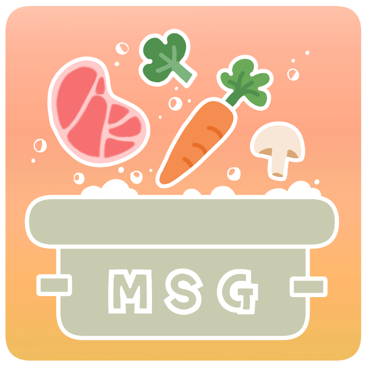
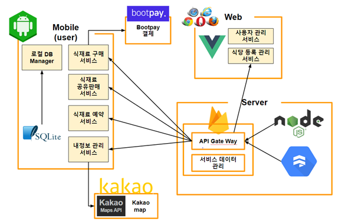

# Welcome to MSG 🙆🙋🙆

## Project Overview 📆

- **진행 기간** : 2020. 03. 16 ~ 2020. 06. 24

- **기획 목표** :

  - 사용자는 여분의 식재료를 공유하고 저렴하게 구매 할 수 있다.

  - -	식당은 남는 식재료를 판매해 남는 식재료 폐기에 대한 손해를 최소화하고 또 다른 수익과 식당 홍보 효과를 얻을 수 있다.

- **서비스명** : MSG

- **차별화 포인트**

  - 음식 명으로 관련 식재료를 검색하는 기능

  - 식재료 예약 서비스

## System Architecture 🖥️

